

## Το ChatGPT και πως επηρεαζεται το Development

---

::: id=my-id

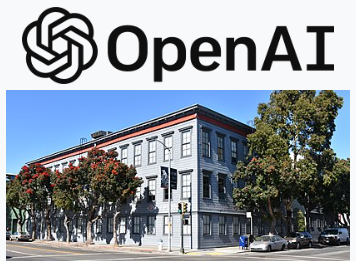

Η OpenAI είναι μια αμερικανική εταιρεία τεχνητής νοημοσύνης που ιδρύθηκε το 2015 από μια ομάδα επιστημόνων και επιχειρηματιών, συμπεριλαμβανομένων των Elon Musk και Sam Altman
:::

--

Έχει αναπτύξει ορισμένα από τα πιο προηγμένα συστήματα τεχνητής νοημοσύνης

::: id=my class=fragment flex

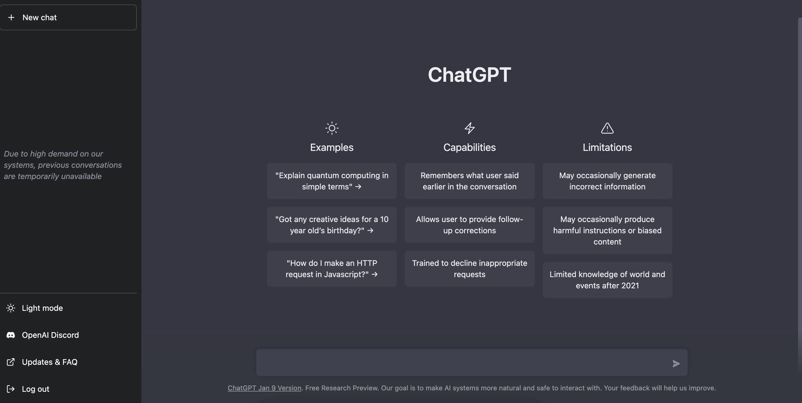
Chat GPT
:::

::: id=my class=fragment flex
DALL-E

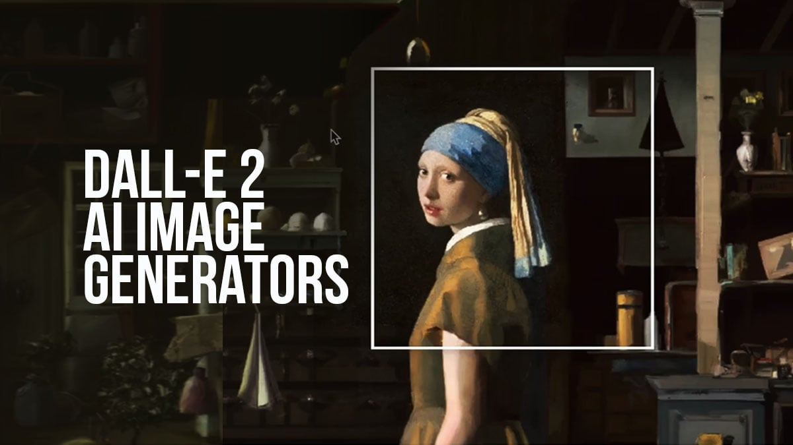
:::

::: id=my class=fragment flex

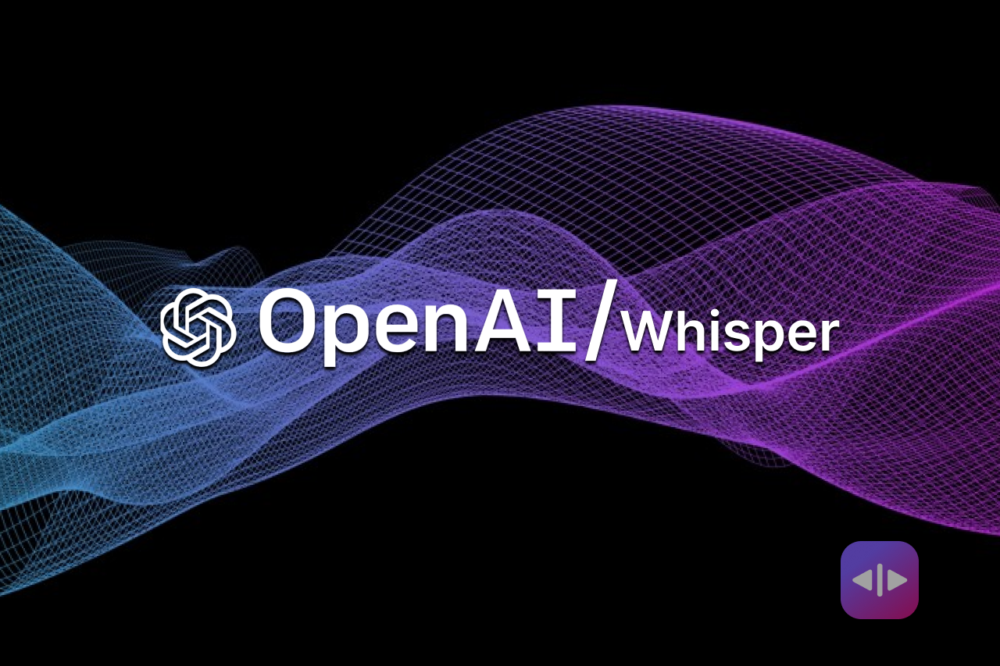
Whisper
:::

--

Το OpenAI χρησιμοποιεί τα πιο προηγμένα γλωσσικά μοντέλα για να εξελίσσεται συνεχώς και να προσφέρει τις καλύτερες λύσεις στους προγραμματιστές.

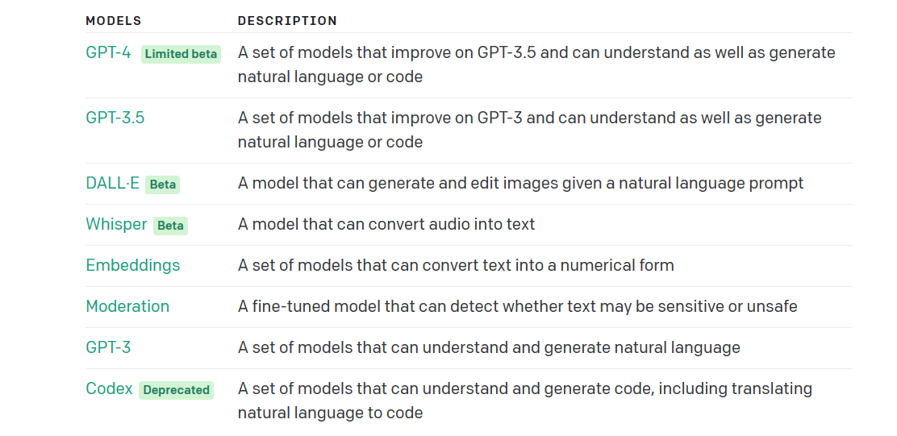
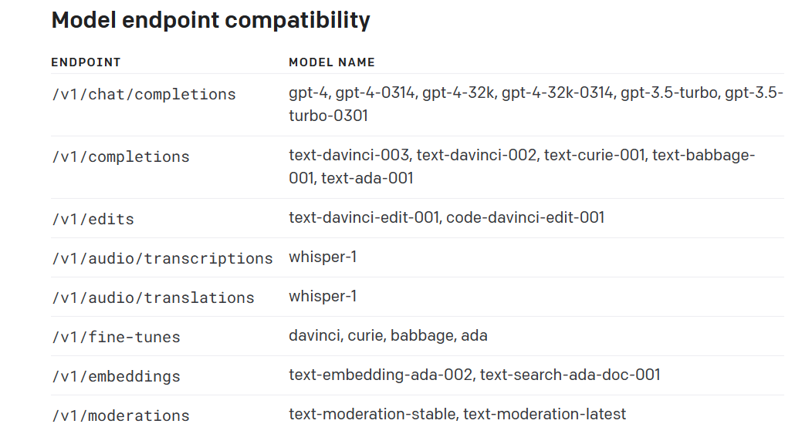
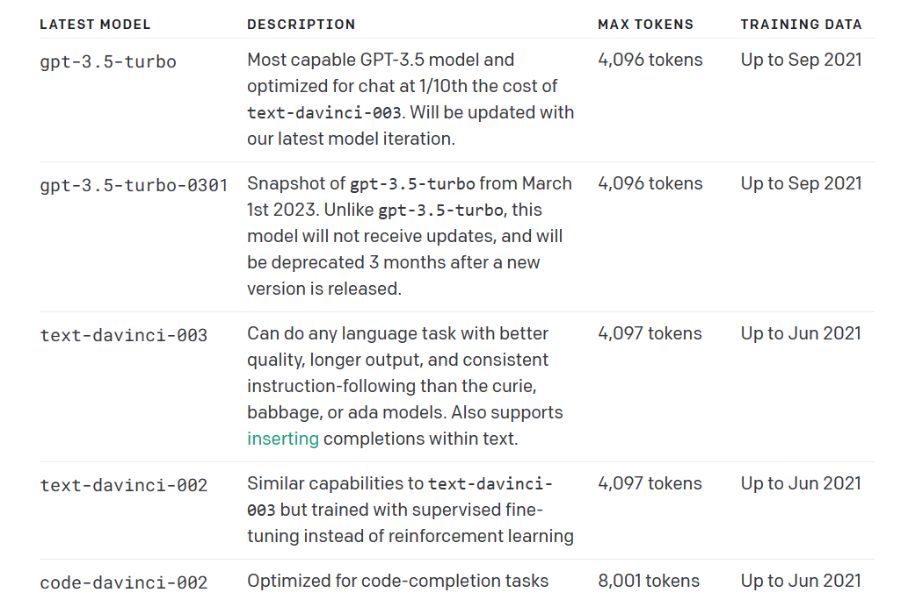
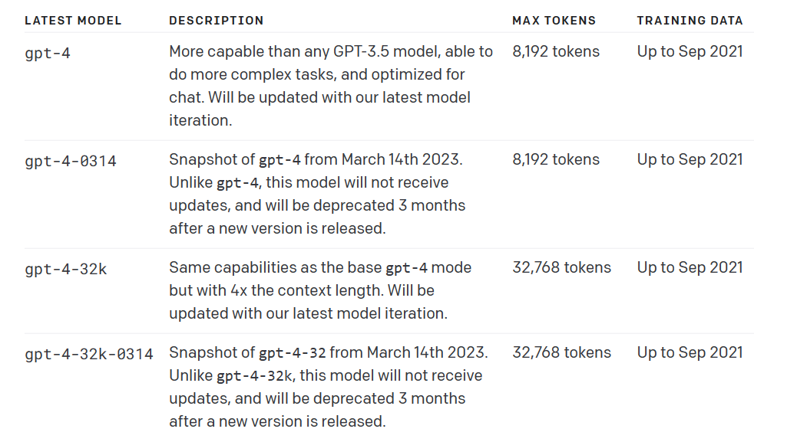

--

Λειτουργεί ως ένα αποθετήριο τεχνολογιών AI που βοηθάει τους προγραμματιστές να δημιουργήσουν εφαρμογές και λύσεις που χρησιμοποιούν AI σε διάφορους τομείς της ζωής

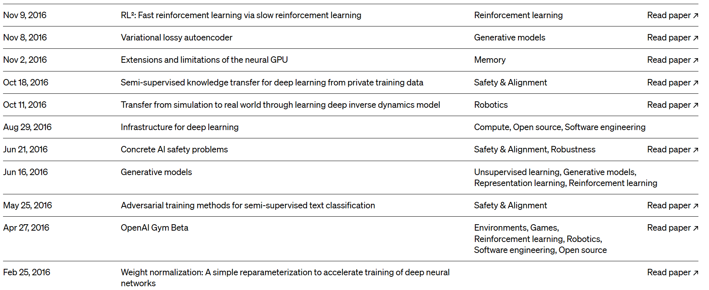
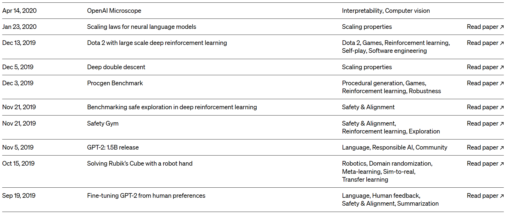
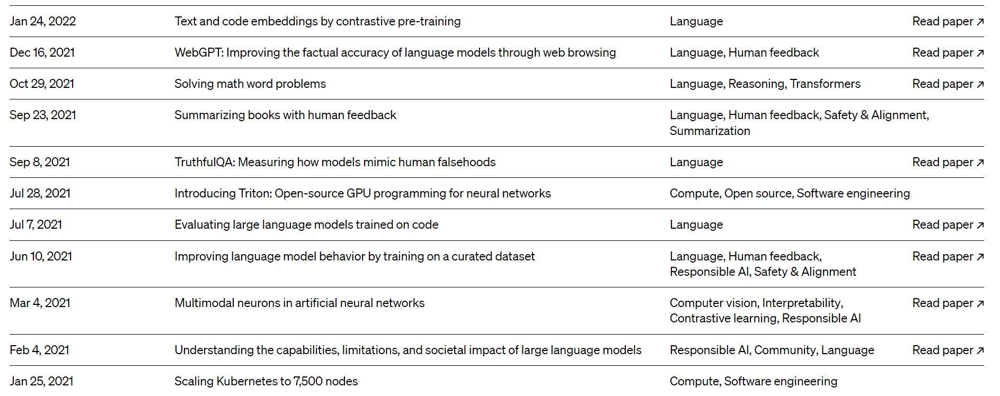
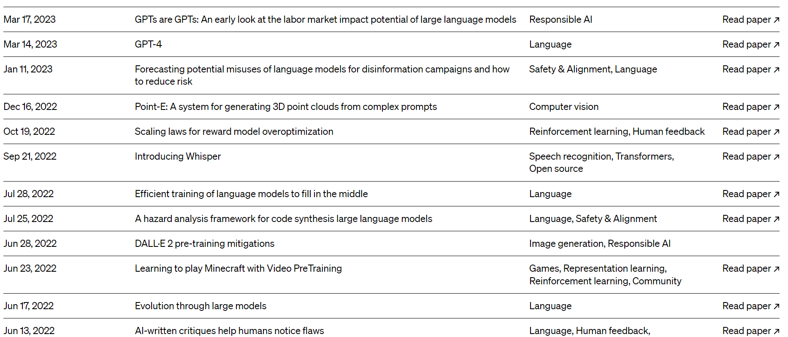

---

### τι ειναι το Chat GPT

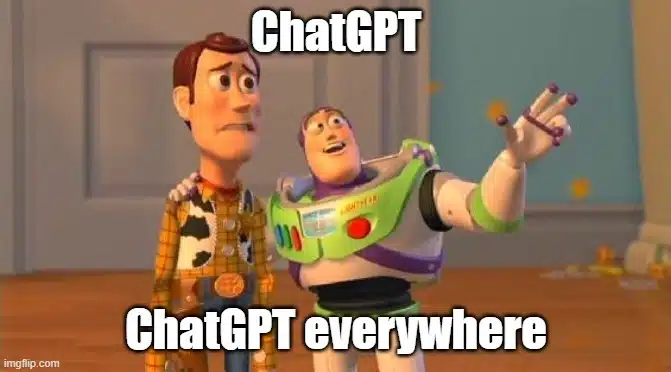

--

Το ChatGPT είναι ένα μεγάλο γλωσσικό μοντέλο που εκπαιδεύτηκε από την OpenAI, χρησιμοποιώντας τεχνικές μηχανικής μάθησης και βαθιάς μάθησης.

Το μοντέλο GPT-3 (Generative Pre-trained Transformer) μπορεί να παράγει αυτόματα κείμενο που μοιάζει πολύ με ανθρώπινο γραπτό λόγο

--

Kατά τη διάρκεια της εκπαίδευσής του, το μοντέλο αναλύει μεγάλους όγκους κειμένου και μαθαίνει τα πρότυπα και τις συνήθειες της ανθρώπινης γλώσσας.

Πρόκειται για ένα από τα μεγαλύτερα και πιο ισχυρά μοντέλα τεχνητής νοημοσύνης επεξεργασίας γλώσσας μέχρι σήμερα, με 175 δισεκατομμύρια παραμέτρους

--

::: id=my flex
Όταν του δοθεί μια είσοδος, όπως μια ερώτηση ή μια πρόταση, το μοντέλο επεξεργάζεται την είσοδο και παράγει μια απόκριση.

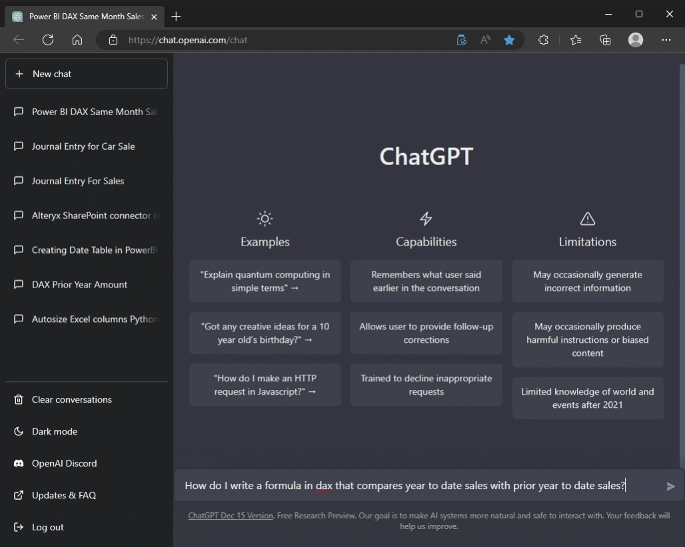
:::

::: id=my class=fragment flex
Η απόκριση που παράγεται από το ChatGPT μπορεί να είναι πολύ πιστή στην ανθρώπινη γλώσσα και να φαίνεται σαν να έχει γραφτεί από άνθρωπο.
:::

--

Χρήση

- Αυτόματη απάντηση σε ερωτήσεις
- Δημιουργία chatbots
- Aυτόματη σύνθεση κώδικα
- Δημιουργία περιεχομένου,όπως άρθρα και blog posts, που μοιάζουν πολύ με ανθρώπινη γραφή.

---

--

<h5>Περιορισμοι</h5>

<ul class="r-fit-text">
  <li class="fragment fade-up">
    
Στην κατανόηση του περιεχομένου:

    

      μπορεί να παράγει συχνά ακατάλληλες ή ασυνάρτητες απαντήσεις, καθώς δεν έχει πλήρη κατανόηση του περιεχομένου της συνομιλίας.
    

  </li>
  <li class="fragment fade-up">
    
Στην ακρίβεια:

    

      μπορεί να παράγει απαντήσεις που δεν είναι απόλυτα ακριβείς ή πλήρεις, καθώς βασίζεται στα δεδομένα που έχει εκπαιδευτεί και στη στατιστική ανάλυση τους.
    

  </li>
  <li class="fragment fade-up">
    
Στην απόδοση σε συγκεκριμένους τομείς:

    

      μπορεί να είναι αποτελεσματικό σε συγκεκριμένους τομείς συνομιλίας, όπως οικείες συνομιλίες ή συνομιλίες για ψυχαγωγικούς λόγους, αλλά μπορεί να αποτύχει σε πιο τεχνικές συνομιλίες.
    

  </li>
  <li class="fragment fade-up">
    
Στην ευθύνη:

    

      καθώς το ChatGPT δεν έχει πλήρη κατανόηση της συνομιλίας, μπορεί να παράγει ακατάλληλες απαντήσεις ή να δώσει λανθασμένες συμβουλές, γεγονός που μπορεί να οδηγήσει σε σοβαρές συνέπειες.
    

  </li>
</ul>

---

GPT-4

--

Το πιο πρόσφατο μοντέλο, GPT-4, κυκλοφόρησε στις 14 Μαρτίου 2023 και είναι πολύ πιο ασφαλές και έχει ακριβέστερες απαντήσεις κατά 40%.

--

Μπορεί να επεξεργαστεί έως 25.000 λέξεις ταυτόχρονα, το οποίο είναι 8 φορές περισσότερο από ό,τι μπορούσε να χειριστεί το Chat GPT-3. Μπορεί να αναλύσει μεγαλύτερα έγγραφα, γεγονός που σημαίνει ότι είναι πολύ πιο αποτελεσματικό.

--

Το Chat GPT-4 είναι πολυτροπικό, δηλαδή μπορεί να καταλάβει διαφορετικούς τρόπους πληροφόρησης, από λέξεις έως εικόνες. Αυτό συμβαίνει επειδή η τελευταία έκδοση του λογισμικού μπορεί να καταλάβει εικόνες.

---

Github CoPilot

--

Το CodePilot είναι ένα εργαλείο του OpenAI που χρησιμοποιεί το μοντέλο γλώσσας του OpenAI (όπως το ChatGPT) για την αυτόματη σύνθεση κώδικα. Λειτουργεί ως πρόσθετο στο περιβάλλον ανάπτυξης Visual Studio Code (VS Code) και βοηθά τους προγραμματιστές να γράψουν κώδικα πιο γρήγορα και εύκολα.

--

Ο χρήστης του CodePilot πληκτρολογεί το όνομα μιας συνάρτησης ή μιας μεταβλητής που θέλει να δημιουργήσει, και το CodePilot προτείνει και αυτόματα δημιουργεί κώδικα βάσει της περιγραφής. Ο προγραμματιστής μπορεί να επιλέξει μια από τις προτεινόμενες επιλογές ή να προσαρμόσει τον κώδικα όπως θέλει.

--

---

To AGI

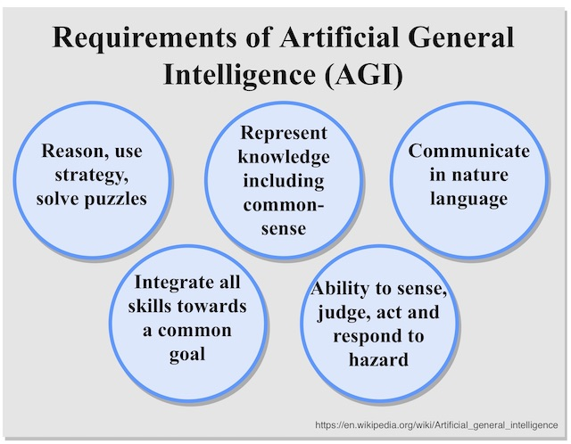

--

AGI είναι η συντομογραφία της Τεχνητής Γενικής Νοημοσύνης (Artificial General Intelligence) και αναφέρεται στη δημιουργία ενός υπολογιστικού συστήματος που μπορεί να αντιληφθεί οποιαδήποτε εργασία που μπορεί να εκτελέσει ένας άνθρωπος.

--

Συγκεκριμένα, το AGI αποσκοπεί στη δημιουργία μηχανών που μπορούν να συλλογιστούν, να μάθουν και να λύσουν προβλήματα όπως οι άνθρωποι. Τα συστήματα AGI θα μπορούσαν να φέρουν επανάσταση σε πολλούς τομείς της κοινωνίας και της βιομηχανίας

---

Ο 75χρονος Τζέφρι Χίντον, ο άνθρωπος που θεωρείται ως ο «νονός» της Τεχνητής Νοημοσύνης» παραιτήθηκε από τη Google, προειδοποιώντας για τους αυξανόμενους κινδύνους από τις εξελίξεις στον τομέα.

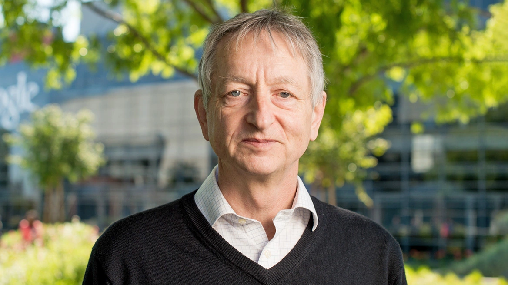

--

Η έρευνα του καθηγητή Χίντον για τα νευρωνικά δίκτυα ήταν αυτή που άνοιξε το δρόμο για τα τρέχοντα συστήματα τεχνητής νοημοσύνης, όπως το ChatGPT

--

<section class="r-fit-text">
  <blockquote cite="Τζέφρι Χίντον">
    "Σύντομα, θα μπορούσε η τεχνητή νοημοσύνη να αποτελέσει κίνδυνο για τις θέσεις εργασίας. Κάποια στιγμή, οι εμπειρογνώμονες υποστηρίζουν ότι θα μπορούσε να αποτελέσει κίνδυνο για την ανθρωπότητα. Είναι δύσκολο να δούμε πώς μπορούμε να αποτρέψουμε τους βλαβερούς παράγοντες που θα μπορούσαν να χρησιμοποιήσουν την τεχνολογία για κακούς σκοπούς"
  </blockquote>
  Τζέφρι Χίντον
</section>
